# Documentació de Activitat A03: Aplicació que utilitza ORM Hibernate

- Autor: Yeray Reyes 
- Data: 12/02/2025

## Índex

L'activitat ens permet Inserir, modificar, eliminar i consultar dades d'una base de dades amb Hibernate. Les clases del meu programa son

- Jugador
- Equip
- Lliga
- Classificacio

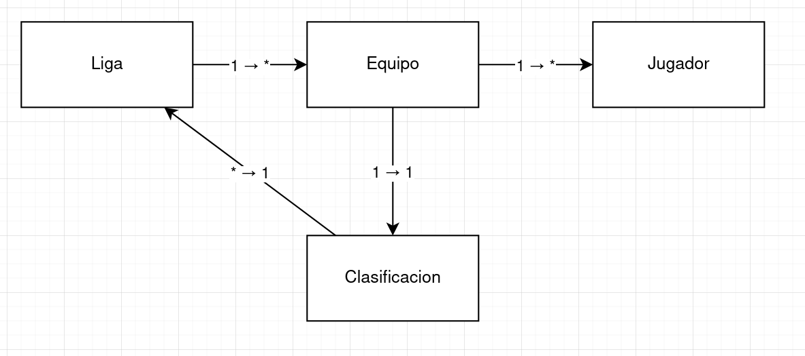

## Prova de funcionament

### Inserció de dades

Inserim una registre a la taula Jugador

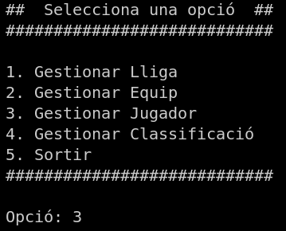
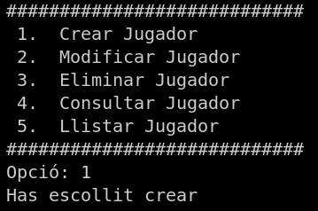
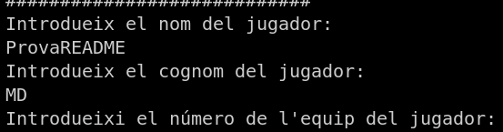
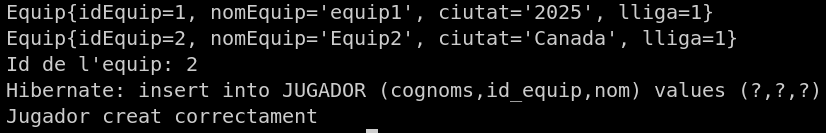

Comprobació:
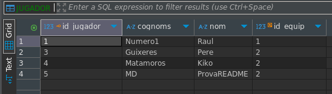

### Llegir de dades

Llegim totes les dades de la taula Equip
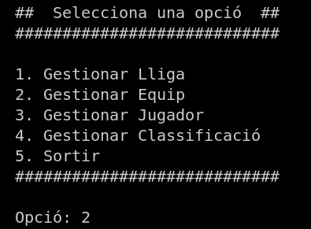
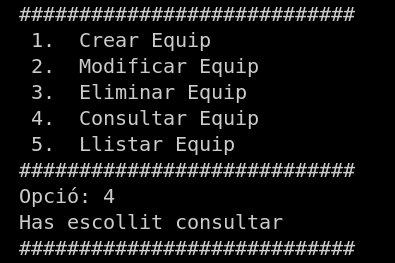
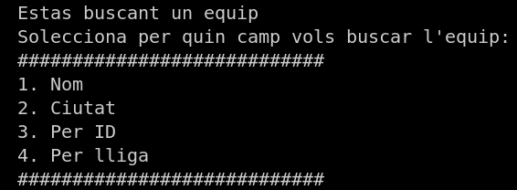
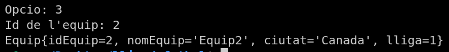

Comprobació:
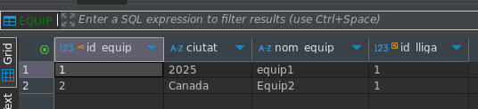

### Modificació de dades
Modificarem la classificació amb ID 1

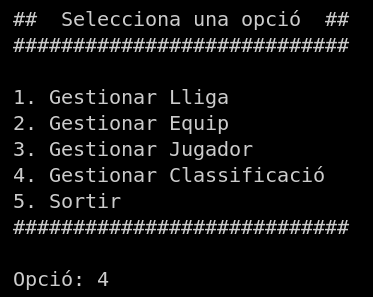
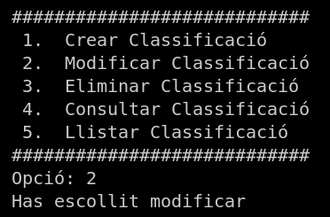
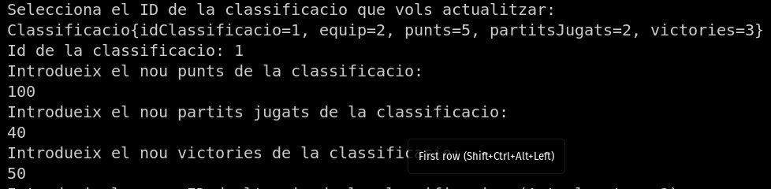
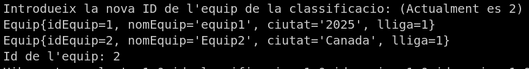
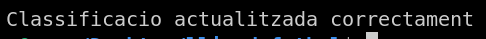

Comprobació:
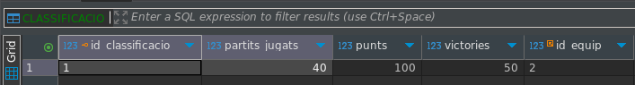

### Eliminació de dades
Eliminarem la lliga amb ID 1

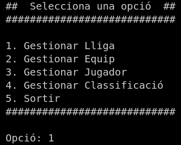
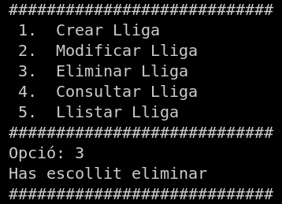
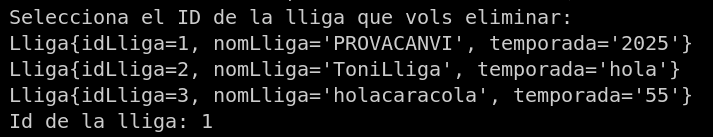
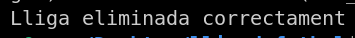
